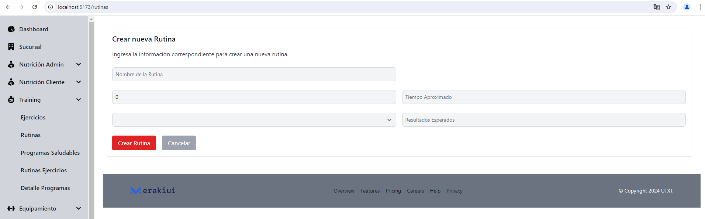
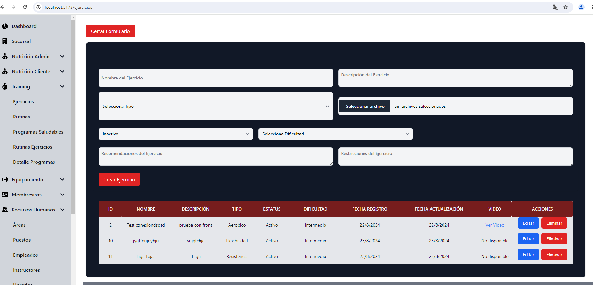
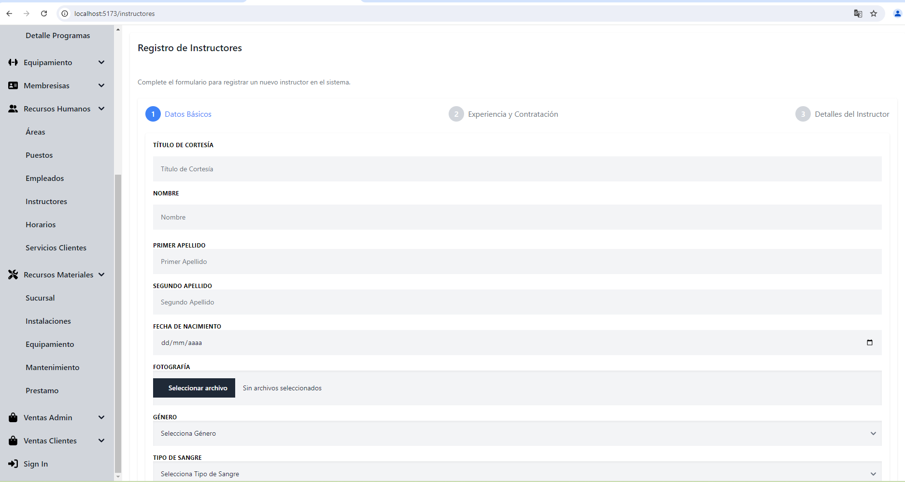
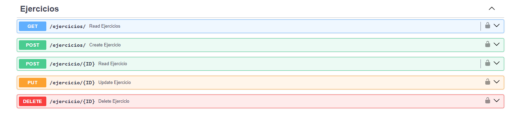
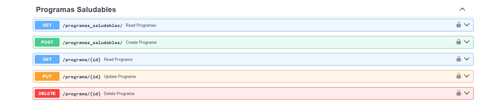
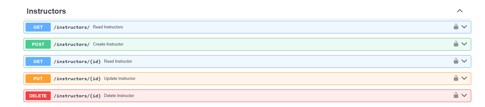

 
 

<h1 align="center"> Universidad Tecnológica de Xicotepec de Juárez </h1>
<h1 align="center"> Ingeniería en Desarrollo y Gestión de Software </h1>
<h1 align="center"> Tarea Integradora </h1>
<h2 align="center"> Noveno Cuatrimestre Grupo B </h2>
 

| PROYECTO                     | Sitio Web GYM BULL´S        |           
| UNIDAD DE NEGOCIO            | Training                    |             

 
 

  
| LOGO DEl SITIO  | 
|:------------- | 

  

 

## Organigrama del equipo
 

  

## Integrantes 
 

| Nombre Completo              | Cargo                   | 
|------------------------------|-------------------------|
| Mario Gutierrez Rosales      | Lider/DB Manager        |           
| Marco Antonio Morales Rivera | Documentador            |             
| Jorge Cruz Cazarez           | Desarrollador Backend   |                      
| Suri Jazmin Peña Lira        | Desarrollador Frontend  | 

 

 

## Objetivo General
Desarrollar un módulo de entrenamiento dentro del sistema web de un gimnasio. Este módulo estará destinado a optimizar la gestión integral de la institución, brindando una plataforma digital que mejore la experiencia tanto de los empleados como de los miembros. 
Además, se buscará proporcionar herramientas que faciliten la creación, seguimiento y personalización de programas de entrenamiento, rutinas de ejercicios y sesiones específicas para los clientes del gimnasio todo esto con el apoyo de instructores y el uso de una dieta adecuada, promoviendo así la adopción de hábitos saludables y una mejor interacción entre el personal y los usuarios.

## Objetivos Específicos
1. **Inicio de Sesión:** Diseñar una interfaz de inicio de sesión intuitiva y atractiva, segura que permita a los usuarios acceder al sistema web del gimnasio.siguiendo el diseño presentado en el mockup.

2. **CRUD y vista de Rutinas:** Desarrollar un formulario de creación de rutinas que permita a los instructores agregar nuevos ejercicios, establecer repeticiones, series y descansos, validando los datos ingresados para evitar errores y garantizar la coherencia de las rutinas creadas.
  
3. **CRUD y vista de Ejercicios:** Diseñar una interfaz limpia y fácil de entender que muestre los ejercicos existentes de forma clara y ordenada, permitiendo a los usuarios ver detalles específicos de cada ejercicio, al igual que, crear, editar y eliminar.
   
4. **CRUD y vista de Programas Saludables:** Diseñar la interfaz o vista de los programas saludables, la cual a través de un formulario, se pueda crear, editar, y eliminar, asi mismo, poder ver los programas saludables existentes, permitiendo a los instructores realizar cambios en los ejercicios, repeticiones y otros detalles según sea necesario.

5. **CURD y vista de Instructores:** Desarrollar un formulario de creación de instructores, el cual solicite los datos como nombre, apellidos, área, entre otros datos.
   

## Pasos para correr el proyecto
1. **Clonar el repositorio** git clone https://github.com/Adalid26Islas/GimnasioFrontEnd-Deploy.git**

2. **Ubicarse en la carpeta de GimnasioFrontend-Deploy para instalar todas las dependecias** npm i 

3. **Correr el proyecto con el comando** npm run dev

## Login de Sitio web

 

## Vista Rutinas:

## Vista Ejercicios:

## Vista Programas Saludables:

## Vista Instrcutroes:

## BackEnd

 

## Rutinas:

## Vista Ejercicios:

## Vista Programas Saludables:

## Vista Instructores:

 
