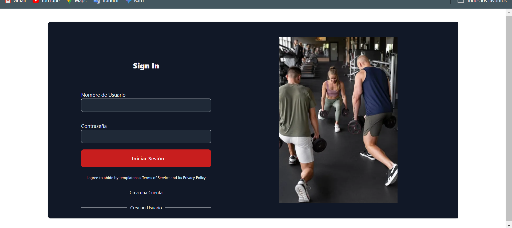

<div align = "center">

# UNIVERSIDAD TECNOLÓGICA DE XICOTEPEC DE JUÁREZ

## Ingeniería en desarrollo y gestión de software

## 9B

# Documentación GymBull
## Introducción:

GymBull es una aplicación innovadora diseñada para la gestión integral de gimnasios. Con GymBull, los administradores pueden manejar fácilmente membresías, programar clases, monitorear el progreso de los clientes y mejorar la comunicación con los miembros. Esta herramienta está diseñada para optimizar las operaciones diarias del gimnasio y ofrecer una experiencia superior tanto para los entrenadores como para los clientes.

# Objetivo

El frontend de GymBull tiene como objetivo ofrecer una experiencia de usuario fluida y eficiente, que integre de manera efectiva la gestión de gimnasio con las funcionalidades de nutrición. Proporciona una plataforma visual y funcional que apoya tanto en la administración del gimnasio como en el seguimiento y planificación nutricional.


# ORGANIGRAMA
.jpg>)
# ESTRUCTURA DEL PROYECTO
</div>

- **.vscode/**: Configuraciones del editor.
- **dist/**: Archivos de construcción para producción.
- **Documentación-Nutrición/**: Documentación específica sobre la nutrición.
- **Imagenes/**: Archivos de imágenes utilizados en la aplicación y la documentación.
- **node_modules/**: Dependencias del proyecto.
- **public/**: Archivos públicos como `index.html`.
- **src/**: Código fuente de la aplicación.
  - **assets/**: Archivos estáticos.
  - **components/**: Componentes Vue reutilizables.
  - **router/**: Configuración de rutas de la aplicación.
  - **styles/**: Estilos globales.
- **apiClient.js**: Configuración y gestión de peticiones a la API.
- **App.vue**: Componente raíz de Vue.
- **main.js**: Punto de entrada principal de la aplicación.
- **.gitignore**: Configuración de exclusiones para Git.
- **index.html**: Plantilla HTML principal.
- **jsconfig.json**: Configuración de JavaScript para el editor.

<div align = "center">
# PASOS PARA CORRER EL REPOSITORIO

## Clonar el repositorio

```sh
1.- git clone https://github.com/Adalid26Islas/GimnasioFrontEnd-Deploy.git
```

## Ubicarse en la carpeta de GimnasioFrontend-Deploy para instalar todas las dependecias

```sh
2.- npm i 
```

## Correr el proyecto con el comando

```sh
3.- npm run dev
```

# CONCLUSIÓN

La documentación del frontend de GymBull proporciona una guía completa para el desarrollo y mantenimiento del proyecto, garantizando que todos los miembros del equipo puedan colaborar de manera eficiente. Esta documentación cubre desde la estructura del proyecto hasta los procesos de instalación, configuración y despliegue, ofreciendo un recurso claro y detallado para desarrolladores nuevos y existentes.

</div>
